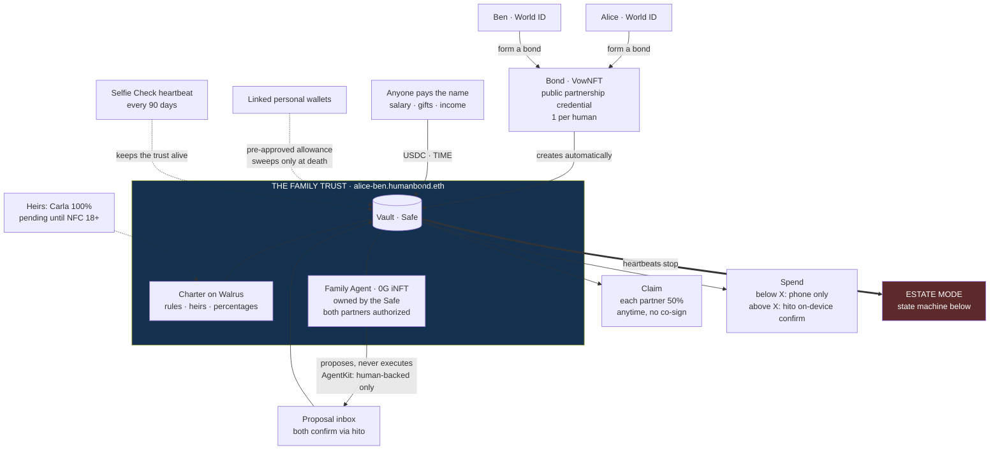
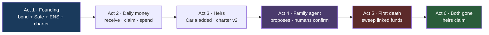
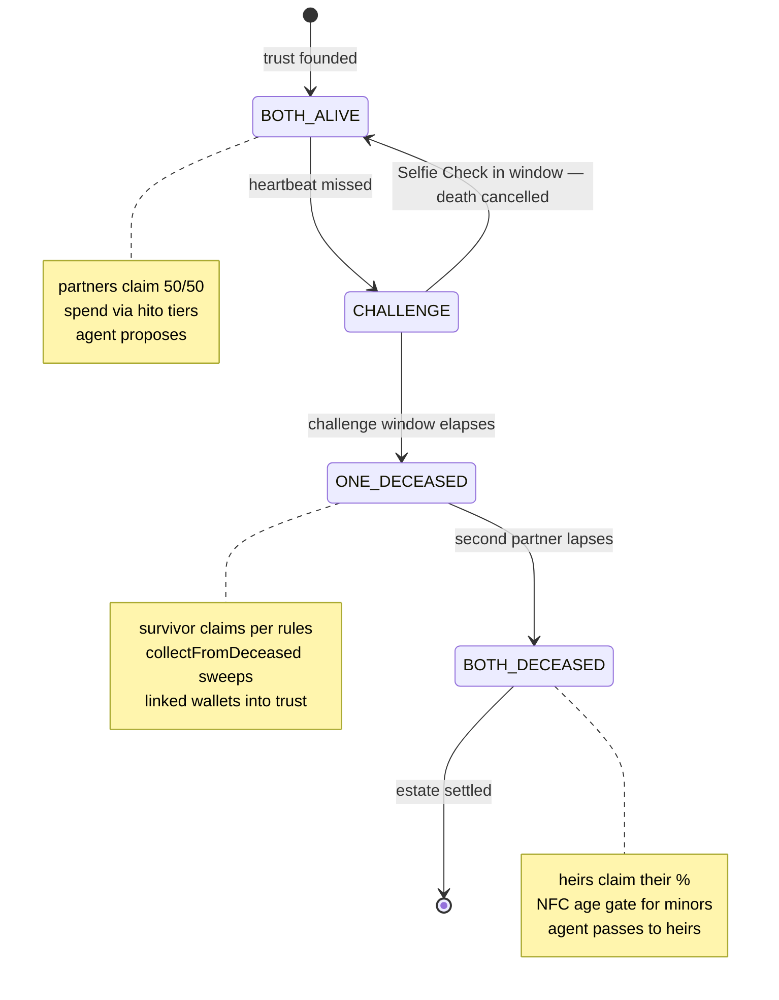

# HumanBond Demo Script — A Family, On-Chain

**Framing:** this is not a couple's wallet demo. It is the life of a **family trust**: founded by two humans, grown by heirs, managed by a **family agent**, and — when its founders die — passed on intact. *The bond that outlives you.*

**What we are building this weekend, said plainly:** when two people share a life, their money lives in systems that don't know they exist — separate accounts, paper wills, passwords in drawers, keys that die with their owners. We give the relationship itself an account. It has a name you can tell your employer. It holds what you build together. It asks for a human hand before big money moves. And when you stop showing up — first one of you, then both — it does exactly what you wrote down: no lawyers, no lost keys, no doubt. Not a wallet with extra steps. **A family that works on-chain.**

## The Product on One Page — everything the living trust does

**How to read this picture, top to bottom:** two verified humans form one bond — the relationship itself, recorded once, provable forever. The bond brings the trust with it: a **vault** that holds the money, a **charter** that holds the rules, an **agent** that does the housekeeping. Money finds the family through one name. From there it moves in exactly four ways — you **claim** your half (no permission needed, it is yours), you **spend** (small on the phone, big with hardware in hand), the **agent proposes** (and never executes), and — the only red box in the picture — when the heartbeats stop, the **estate** takes over. Everything else in this document is this picture, played out in time.

Read it as six promises:

- **The bond** — who you are to each other. Public, exclusive, permanent.
- **The vault** — what you own together. Yours to claim, never locked behind the other's key.
- **The charter** — what you agreed. Will included, impossible to lose.
- **The agent** — who does the work. Thinks for the family, signs for nobody.
- **The heartbeat** — the proof you're still here. A face, not a password.
- **Estate mode** — the promise kept. Exactly what you wrote, exactly when it matters.

## The Demo Arc

Six acts, one life, under three minutes. The first four acts make the audience love the trust; the last two show it keeping its promise. That order **is** the pitch: nobody cares that software survives its users — until they've watched a family live in it.

**The core mechanic — the trust's state machine (spans Acts 2→6):**

Four states, one principle: **nothing about death is decided at death.** Every rule below was set while both partners were alive — the states merely execute what was agreed. And the arrow pointing back up is the one that matters most: as long as you can look into a camera, no missed timer can bury you. A face beats a clock — and no key, stolen or lost, can fake either.

## Cast & Demo Setup (prepare Sat PM — T12)

- **Alice & Ben** — bonded partners. Pre-created World IDs (1 bond per human = no spontaneous bonding on stage), Orb/NFC tier.
- **Carla** — their heir. Demo identity with NFC (age ≥18 verified) for the claim moment.
- **Employer** — any funded wallet that pays USDC to the trust's ENS name.
- **Devices on stage:** 2 phones (mirrored), 2 hito devices, 1 laptop (subgraph/worldscan views).
- **Demo params:** heartbeat interval 2 min (prod: 90 days), challenge window 30 s, Alice's personal demo wallet has **pre-approved the vault** (the "linked wallet" allowance the sweep needs).

---

## Act 1 — Founding (Scene 1: Bond)

Two minutes ago, these were two strangers to the chain. Now they leave with a name, a vault, and a will. The founding must feel like a ceremony, not a setup wizard — this is the wedding, the bank appointment, and the notary visit collapsed into one flow.

| Screen | What happens | On-chain |
|---|---|---|
| **S1 Verify** | Tier badges (Selfie / NFC / Orb). Copy states the gate: *"A shared trust needs NFC or Orb verification."* | World ID proof |
| **S2 Propose** | Alice picks Ben (QR / username) | `proposeBond()` (live contract) |
| **S3 Vows** | Ben accepts; vow text shown; VowNFT preview | `acceptBond()` → VowNFT |
| **S4 Trust is born** | One celebratory screen: Safe created · `alice-ben.humanbond.eth` registered · charter stored on Walrus (blob ID visible) | Safe deploy · ENS subname · Walrus blob |
| **S5 Trust settings** | Three onboarding steps: (a) inheritance opt-in — *"Is this the trust your life savings should flow to when you die?"* (b) hito threshold slider — *"ask my hardware wallet above $X"* (c) hito pairing (W1) | threshold stored in vault config |

## Act 2 — Daily Life (Scenes 2+3: Money & Hardware)

Money is where trust gets real. This act proves the everyday: getting paid, taking your half without asking anyone, buying coffee without friction — and hitting a hardware wall exactly when the amount deserves one. If the audience believes the Tuesday, they'll believe the funeral.

| Screen | What happens | On-chain |
|---|---|---|
| **S6 Trust home** | Balance · members · ENS address front and center (this IS the routing story: give this address to whoever pays you) · per-member monthly spend stat · heartbeat status chips (green) | reads vault |
| **S7 Receive** | Employer sends 1,000 USDC to the ENS name → balance ticks up live. **Nothing splits, nothing forwards** — the money arrives and waits to be claimed | ERC-20 transfer to Safe |
| **S8 Claim** | Ben claims his 50% to his personal wallet — one tap, no co-signature. *Claims, not custody.* | `claim()` on vault |
| **S9 Spend small** | Alice pays $8 (below threshold) — phone only, instant | Safe tx |
| **S10 Spend large** | Alice tries $500 → **hito lights up**, shows real recipient + amount on its own display (WYSIWYS), she confirms on-device | Safe tx w/ hardware signer (W2) |

## Act 3 — The Family Grows (Scene 5a: Heirs)

One screen, one slider — and the couple becomes a family. Adding an heir should feel as light as adding a contact, because the heaviness is carried by the protocol, not the user. Carla doesn't need a wallet, an app, or even to know this happened. She just needs to exist.

| Screen | What happens | On-chain |
|---|---|---|
| **S11 Heirs** | Add Carla: % slider (e.g. 100% after both gone). Two modes: wallet address OR *"no wallet yet"* → pending entry, note: *"claimable once she verifies (NFC, 18+)"* | heir row in vault claims table |
| **S12 Charter v2** | Updated charter (heir allocations) re-stored on Walrus — *"a will that cannot be lost"* — visible in trust home | Walrus blob v2 |

## Act 4 — The Family Agent (Scene 4: Agents, Saturday)

The trust gets staff. The family agent works for the charter, not for either partner — it can think, draft, and propose, but the only hands that can move money are human hands on hardware. This act carries two prize tracks in one scene: an agent that must prove its human backing (AgentKit), thinking in a place where its thoughts can be verified (0G).

| Screen | What happens | On-chain |
|---|---|---|
| **S13 Personal agent chat** | Leon (as Ben) tells **his personal agent**: *"Ask our family agent to set aside 100 USDC a month for Carla."* | — |
| **S14 Family agent thinks** | The **family agent** (0G, owned by the Safe, both partners authorized via `authorizeUsage`) checks the charter, runs TEE-verified inference, drafts a proposal. **AgentKit badge:** *"requested by a verified human member of this trust"* — bots without human backing are refused (show one refused request!) | 0G inference proof · AgentKit verification |
| **S15 Proposal inbox** | Proposal card: amount, purpose, TEE signature, confirmation status Alice ⬜ / Ben ⬜ → **both hito devices light up** → both confirm → executes | Safe proposal → threshold sigs → exec (W3+W4) |

**The refused-bot beat matters:** AgentKit's track is "tell a bot from a human-backed agent" — show the negative case for 10 seconds.

**Act 4 additions (Sat night):** (a) **Routing contrast** — "buy tickets for us" routes to the trustee with visible reasoning, "buy me shoes" stays in the personal wallet under the private rule, Alice never involved: two requests, 20 seconds, the whole cascade understood. (b) **Negotiation visible** — the two agents' discussion (cash-flow argument vs. income comparison) appears as typed reasoning before any proposal. (c) **Proposal release via hito** — the negotiated proposal (amount · split · recipient ENS) is a card the human releases on hardware; and the **feelings loop**: "I don't feel good about this" sends the agents back to renegotiate (e.g. Alice covers this one). Money never moves on agent agreement alone.

**The full choreography (W3+W4):**

```mermaid
sequenceDiagram
    actor Ben
    participant PA as Personal Agent
    participant FA as Family Agent<br/>0G · owned by Safe
    participant AK as World AgentKit
    participant Safe as Trust Safe
    participant HA as hito Alice
    participant HB as hito Ben
    Ben->>PA: set aside 100 USDC monthly for Carla
    PA->>FA: request on Ben's behalf
    FA->>AK: verify human backing of requester
    AK-->>FA: verified — bonded member
    Note over FA: charter check + TEE-verified inference
    FA->>Safe: proposal (TEE-signed)
    Safe-->>HA: confirmation request
    Safe-->>HB: confirmation request
    Note over HA,HB: both devices show real<br/>recipient + amount (WYSIWYS)
    HA-->>Safe: confirmed on device
    HB-->>Safe: confirmed on device
    Safe->>Safe: execute
    rect rgb(90, 40, 40)
    Note over PA,AK: negative case: unbacked bot request → AgentKit refuses → no proposal rights
    end
```

## Act 5 — The First Death (Scene 5b)

The act nobody builds features for — and the reason we exist. One partner goes silent. The system doesn't panic: it waits, asks for a face, waits again. Only then does it act — gathers what was promised into the trust and hands the survivor exactly what was agreed. Grief comes with enough paperwork; this act deletes that part.

| Screen | What happens | On-chain |
|---|---|---|
| **S16 Heartbeat lapse** | Alice's chip turns amber → *"Alice hasn't confirmed life in 2 min"* → challenge window countdown. **Twist first:** Alice returns, taps check-in, **Selfie Check verifies her face → death cancelled.** *"No key can fake this."* Then (demo) she lapses for real. | `checkIn()` Selfie-gated · then state → ONE_DECEASED |
| **S17 Trust in mourning** | Trust home in muted state: *"Alice · deceased."* Ben taps **"Collect Alice's linked funds"** → her pre-approved personal wallet is swept into the trust (**Geld wird eingezogen**). Ben's claims now follow Alice's rules; the family agent keeps working, confirmations now Ben-only. | `collectFromDeceased(token, alice)` via allowance |

## Act 6 — The Bond Outlives Them (Scene 5c)

The last act inverts the product: its users are gone, and it still works. Carla has never touched this app before today — she inherits with a passport tap. No probate court, no safe-deposit box, no uncle with a USB stick. The bond outlives its people; the audience doesn't hear that as a slogan anymore, because they just watched it happen.

| Screen | What happens | On-chain |
|---|---|---|
| **S18 Second lapse** | Ben lapses too → state BOTH_DECEASED. The trust does not die — it waits. | state transition |
| **S19 Heir claim** | Carla opens the app, NFC-verified (≥18) → *"You are the heir of alice-ben.humanbond.eth"* → claims her share. VowNFT & milestones remain as soulbound memory. Closing line: the family agent — with its memory — passes to her (`transfer()`/`authorizeUsage`, ERC-7857). *"She doesn't just inherit the money. She inherits the manager who knows the family."* | heir `claim()` · (agent handover: pitch line, build only if 0G booth confirms key handling) |

**Closing shot:** the laptop — subgraph query showing the bond's whole life as public record: founded, funded, grown, mourned, inherited.

---

## Screen Inventory → Build Mapping

| Screens | Build task | Owner |
|---|---|---|
| S1–S3 | exist (live app) + tier-gate copy (T4) | Franco |
| S4–S5 | T1+T2+T3 UI + settings flow (T6/T7) | Franco + Leon copy |
| S6–S8 | trust home + claim (T1 UI) | Franco |
| S9–S10 | hito W1/W2 (T7) | Mischa |
| S11–S12 | heir UI (T6) + Walrus v2 (T3) | Franco + Leon |
| S13–S15 | agents (T8/T9/T10) + proposal inbox UI | Francesca + Franco + Mischa |
| S16–S18 | heartbeat UX + death states (T5 + **new: T15**) | Franco + Mischa |
| S17 collect | **new: T14 sweep function** — `collectFromDeceased()`, one function, allowance-based | Mischa |
| S19 | heir claim flow (T6 extension) | Franco |

## On-Chain Events (what the subgraph indexes — T11)

BondCreated · TrustCreated · CharterStored(v) · Received · Claimed · ThresholdSet · ProposalCreated/Confirmed/Executed · CheckIn · DeathStateEntered/Cancelled · FundsCollected · HeirClaimed

## Timing

- **Video (<3 min, Sat night):** Act 1 30s · Act 2 40s · Act 3 15s · Act 4 45s · Act 5 30s · Act 6 20s
- **Live judging (if longer):** same order, the resurrection beat (S16) and the double-hito confirm (S15) are the two moments to milk.
